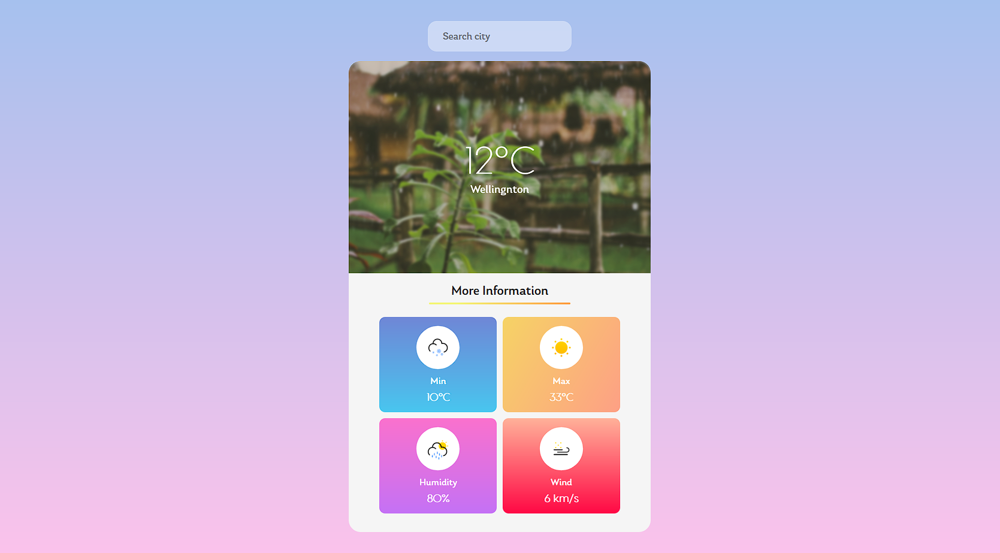

<h1 align="center">
  Weather App
</h1>

  

  <a href="#-tecnologias">Tecnologias</a>&nbsp;&nbsp;&nbsp;|&nbsp;&nbsp;&nbsp;
  <a href="#-projeto">Projeto</a>

## 🚀 Tecnologias

Esse projeto foi desenvolvido com as seguintes tecnologias:

- HTML
- [SCSS](https://sass-lang.com/)
- [Angular](https://angular.io/)
- [Typescript](https://www.typescriptlang.org/)
- [API](https://rapidapi.com/hub)

## 🚧 Projeto:

Finalizado

## 🎨 Inspiração:

Youtube: https://www.youtube.com/c/SameerSaini  
Github: https://github.com/birobirobiro

---

Feito com ♥ by Matheusvgdr